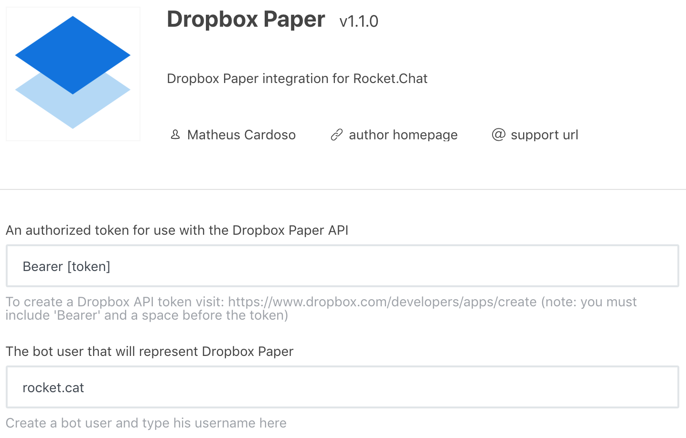
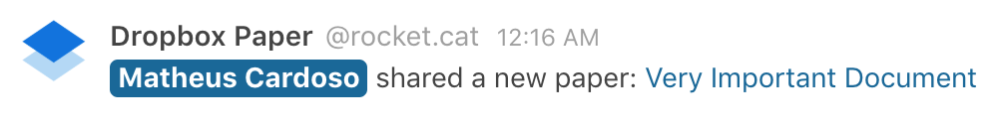

# Rocket.Chat.Dropbox.Paper
📦 Dropbox Paper App for Rocket.Chat - create and share live documents in your Rocket.Chat channel

## Usage
### Commands
This App only supports one command right now:
`/dropbox-paper-create [Title of Paper] (optional)`

This will create a new paper and share the secret link with the room.

## Planned features
See the [issues list](https://github.com/cardoso/Rocket.Chat.Dropbox.Paper/issues)
